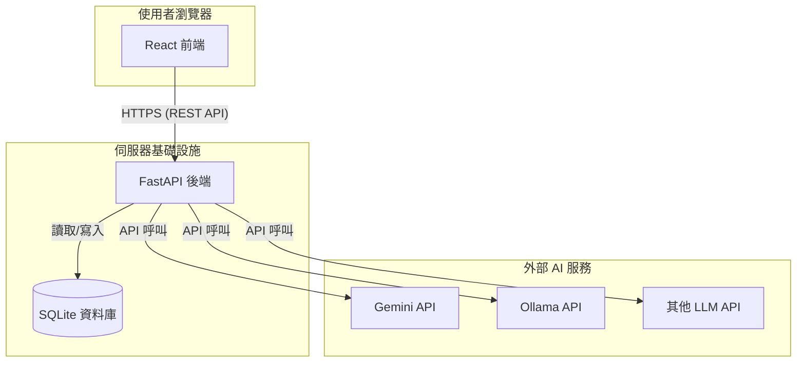

# 系統架構：AI 多方專家協作系統

本文件概述了「AI 多方專家協作系統」的建議軟體架構。此系統被設計為一個現代化的網頁應用程式，採用分離式的前後端架構（JAMstack 方法），透過 RESTful API 進行通訊。

## 1. 高階系統圖 (C4 模型 - 第二級)

## 2. 前端 (Frontend - React)

前端是一個使用 React 建置的單頁應用程式（SPA）。它負責處理所有使用者互動與渲染使用者介面。

### 關鍵組件 (Key Components):
-   **`App.js`**: 主要的應用程式組件，負責路由和整體佈局。
-   **`ConversationView`**: 顯示 AI 專家之間即時更新對話的主要視圖。
-   **`ExpertPanel`**: 用於在會話中新增、設定和移除 AI 專家的組件。每個專家都有其自己的設定（角色、任務、風格）。
-   **`Controls`**: 包含主要主題的輸入框以及啟動/停止會話的按鈕。
-   **`SettingsModal`**: 一個彈出視窗，用於管理角色、任務和風格的庫（包含CRUD和匯入/匯出功能）。
-   **`HistoryViewer`**: 用於瀏覽、檢視和管理過去對話的組件。
-   **`apiClient.js`**: 一個專門的模組，用於處理與後端 API 的所有通訊。

## 3. 後端 (Backend - FastAPI)

後端是一個使用 FastAPI 建置的 Python 應用程式。它為前端提供 RESTful API，並負責協調 AI 協作會話。

### 關鍵模組 (Key Modules):
-   **`main.py`**: FastAPI 應用程式的進入點，定義 API 端點。
-   **`database.py`**: 管理與 SQLite 資料庫的連接，並定義資料模型（使用 SQLAlchemy 或類似的 ORM）。
-   **`schemas.py`**: 定義用於資料驗證和序列化的 Pydantic schema（例如，定義一個 `Persona` 物件的樣貌）。
-   **`crud.py`**: 包含對資料庫進行 CRUD（新增、讀取、更新、刪除）操作的可重用函式。
-   **`ai_orchestrator.py`**: 管理對話的核心邏輯。它將處理回合制的討論、呼叫適當的 AI 模型，並管理對話狀態。
-   **`llm_clients/`**: 一個包含與外部 AI 服務互動的不同模組的目錄（例如 `gemini_client.py`, `ollama_client.py`）。

### 規劃中的 API 端點 (Planned API Endpoints):

-   **`POST /api/sessions`**: 啟動一個新的對話會話。
-   **`POST /api/sessions/{session_id}/stop`**: 停止一個正在進行的會話。
-   **`GET /api/sessions/{session_id}`**: 獲取會話的狀態和訊息（可用於輪詢或 WebSockets）。
-   **`GET /api/history`**: 獲取所有過去的對話列表。
-   **`GET /api/history/{convo_id}`**: 獲取特定過去對話的詳細資訊。
-   **`POST /api/history/import`**: 匯入對話歷史。
-   **`GET /api/history/export`**: 匯出對話歷史。
-   **`GET /api/roles`, `POST /api/roles`, `PUT /api/roles/{id}`, `DELETE /api/roles/{id}`**: 對「角色」的完整 CRUD 操作。
-   **`GET /api/tasks`, `POST /api/tasks`, `PUT /api/tasks/{id}`, `DELETE /api/tasks/{id}`**: 對「任務」的完整 CRUD 操作。
-   **`GET /api/styles`, `POST /api/styles`, `PUT /api/styles/{id}`, `DELETE /api/styles/{id}`**: 對「風格」的完整 CRUD 操作。
-   **`POST /api/settings/import`, `GET /api/settings/export`**: 匯入/匯出設定。

## 4. 資料庫結構 (Database Schema)

資料庫將包含以下資料表：
-   **`roles`**: (id, name, prompt)
-   **`tasks`**: (id, name, description)
-   **`styles`**: (id, name, prompt)
-   **`conversations`**: (id, topic, start_time, end_time)
-   **`messages`**: (id, conversation_id, speaker_name, expert_type, content, timestamp)

此架構為建構所要求的功能提供了一個堅實的基礎，同時保持了可擴展性和可維護性。
