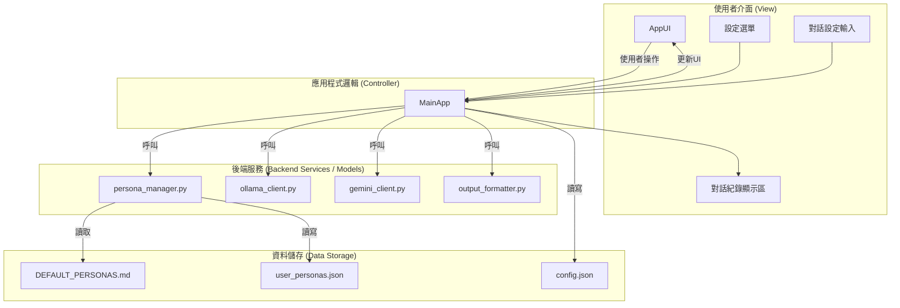

# 系統架構書 (Software Architecture)

本檔案闡述 "AI Debate Club" 專案的軟體架構設計。本專案採用**模組化分層架構**，旨在實現高內聚、低耦合的設計目標，從而提高程式的可維護性、可擴展性和可測試性。

## 1. 系統流程圖 (Mermaid)

## 2. 模組職責詳解

### `src/`
所有核心應用程式碼的存放目錄。

### `app.py` (應用程式主邏輯 - Controller)
- **職責**: 擔任應用程式的總指揮，是UI與後端服務之間的橋樑。
- **功能**:
    - 應用程式的進入點，負責初始化和啟動UI。
    - 接收來自 `ui.py` 的使用者事件（例如按鈕點擊、選單選擇）。
    - 協調其他模組的工作，根據使用者選擇呼叫對應的客戶端 (`ollama_client` 或 `gemini_client`)。
    - 管理背景執行緒（threading），防止網路請求操作（如獲取模型列表、AI生成對話）阻塞UI。
    - 管理應用程式狀態，如載入的API金鑰、角色列表等。
    - 將後端模組產生的資料（對話內容、模型列表）傳遞回 `ui.py` 進行顯示。

### `ui.py` (使用者介面 - View)
- **職責**: 負責所有與使用者互動的視覺元件。
- **功能**:
    - 使用 `tkinter` 函式庫建立應用程式的主視窗和所有小工具（widgets）。
    - 包含主應用視窗 (`AppUI`)、API金鑰視窗 (`ApiKeyWindow`)、角色管理視窗 (`PersonaManagerWindow`) 和角色編輯視窗 (`PersonaEditorWindow`)。
    - 將使用者的操作（如點擊、輸入）作為事件傳遞給 `app.py` 進行處理。
    - 提供更新畫面的介面函式，供 `app.py` 呼叫。

### `ollama_client.py` & `gemini_client.py` (資料存取層 - API Clients)
- **職責**: 分別處理與Ollama REST API和Google Gemini API之間的所有通訊細節。
- **功能**:
    - 封裝各自的API呼叫。
    - 提供獲取可用模型列表的介面 (Ollama) 或返回支援的模型列表 (Gemini)。
    - 提供 `generate_response()` 函式來生成單一回應。
    - 處理各自API的錯誤和資料格式。

### `persona_manager.py` (角色管理服務)
- **職責**: 集中處理所有與角色（Persona）相關的讀寫操作。
- **功能**:
    - 從 `DEFAULT_PERSONAS.md` 讀取並解析預設角色。
    - 從 `user_personas.json` 讀取、寫入、更新使用者自訂的角色。
    - 提供一個統一的 `get_all_personas()` 函式供主應用程式呼叫。

### `output_formatter.py` (輸出服務)
- **職責**: 負責將結構化的對話紀錄轉換為不同的檔案格式。
- **功能**:
    - 提供 `to_txt()`, `to_csv()`, `to_md()`, `to_docx()`, `to_xlsx()` 等函式。
    - 接收一個標準化的對話日誌作為輸入，輸出對應格式的字串或直接寫入檔案。

## 3. 設計原則

- **關注點分離 (Separation of Concerns)**: 每個模組只做一件事。UI只管顯示，客戶端只管通訊，管理器只管資料存取，主程式只管協調。
- **依賴倒置 (Dependency Inversion)**: `app.py` 依賴於 `ollama_client` 和 `gemini_client` 的函式介面，而不是它們的具體實現。未來可以輕易地新增更多客戶端模組。
- **可擴展性**: 當需要支援新的AI模型或新的存檔格式時，我們可以建立新的模組，而對現有穩定程式碼的影響降到最低。
